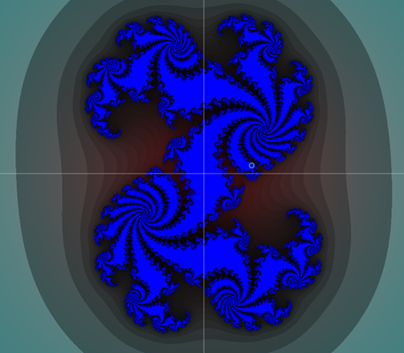
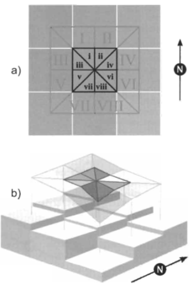
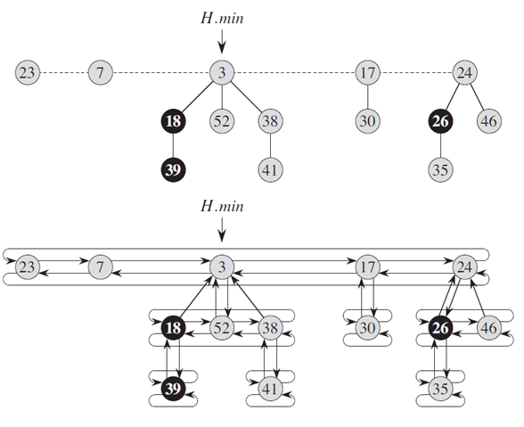
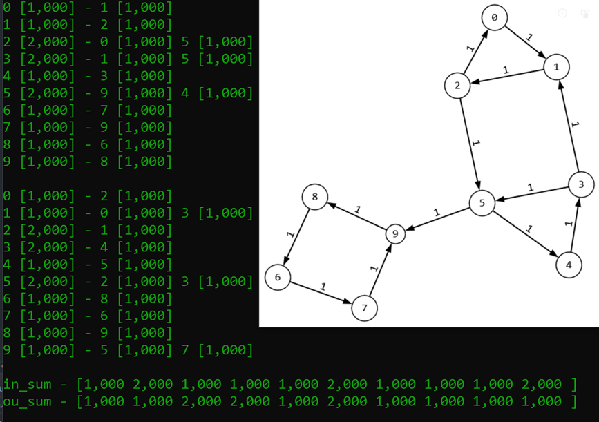
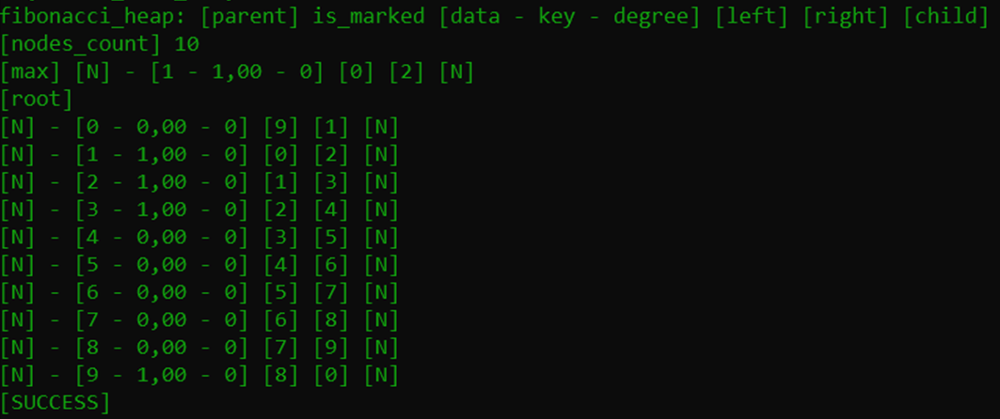
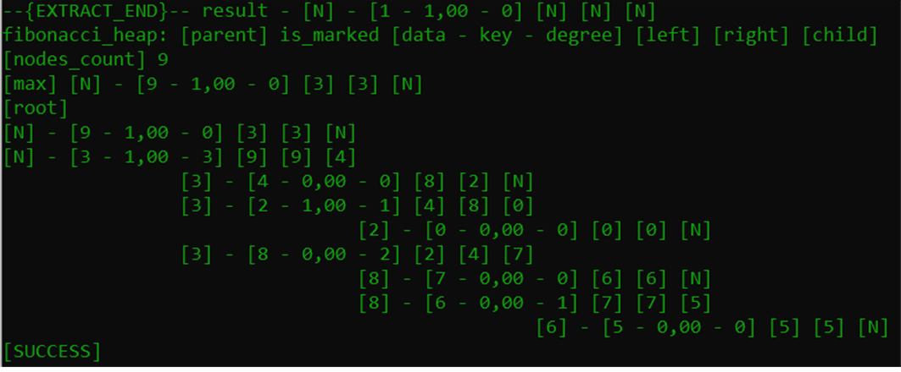
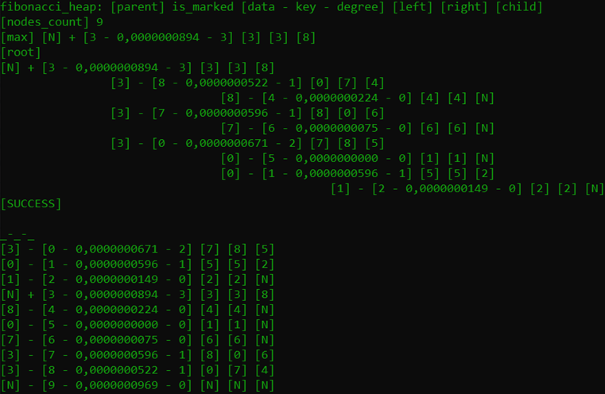
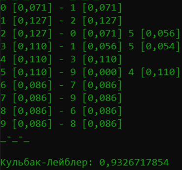
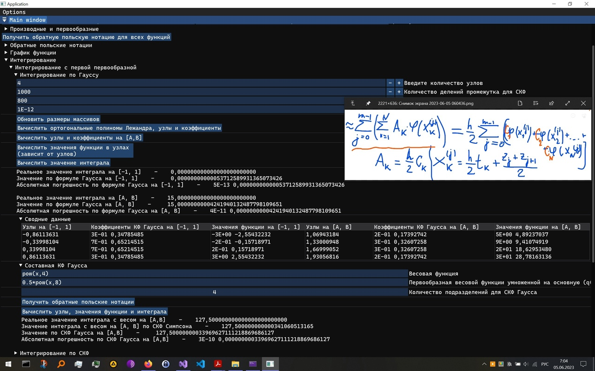
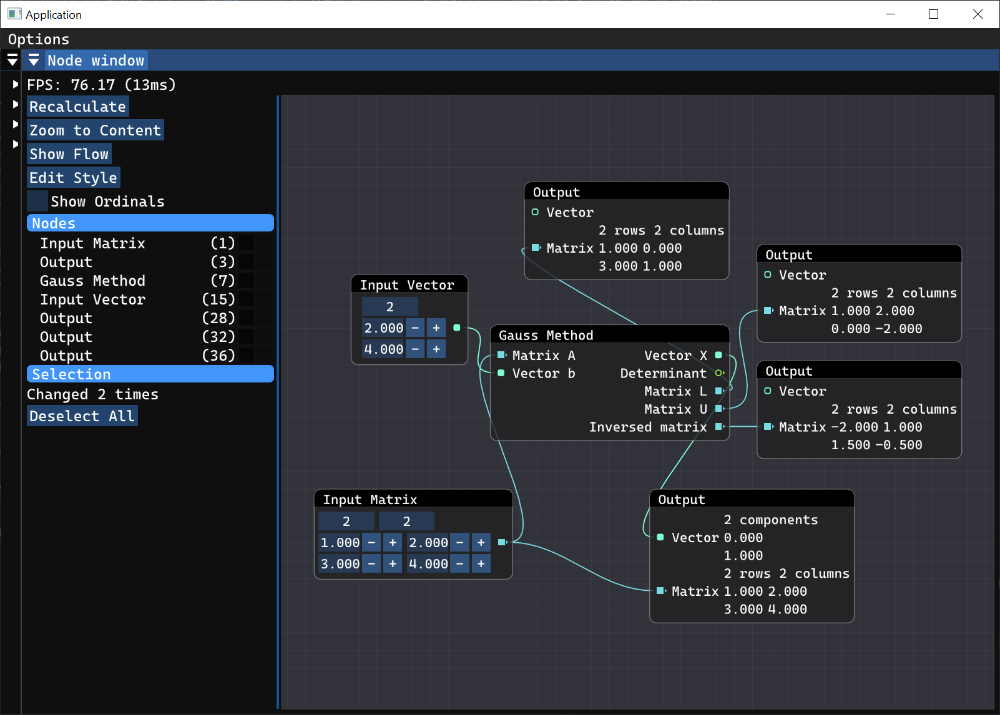

Description (EN)
-
This is a project containing solutions to problems in C and C++ that arose during my studies at the university from the first to the fifth semester. The solved problems for the sixth and seventh semesters can be found in the amcs-app repository, a Tauri project written in Rust and HTML, CSS, TS. Other research works can also be found in other repositories.

This project does not have a clear internal structure. Instead, filters in Visual Studio were used. This worked well for this project. A small Python script was created to create a hierarchy based on VS filters to show it here.

RU
-
Этот проект содержит решения задач на языках программирования Си и C++, которые были даны в течение учёбы в университете с первого по пятый семестры. Решённые задачи за шестой и седьмой семестры можно найти в репозитории amcs-app, проекте Tauri, написанном на Rust и HTML, CSS, TS. Другие исследовательские работы также можно найти в других репозиториях.

Этот проект не имеет чёткой внутренней структуры. Вместо неё были использованы фильтры Visual Studio. Для этого проекта это сработало хорошо. Был создан небольшой скрипт Python для создания иерархии на основе фильтров VS, чтобы показать её здесь.

1 Term (C)
-

1. Mod pow: $x ^ y \ mod \ m$

2. Greatest common divisor: $gcd(x,y)$
3. Extended Euclid: $xa+yb=gcd(a,b)$
4. Linear diophantine: $a_{0}x_{0} + a_{1}x_{1} + ... + a_{n-2}x_{n-2} + a_{n-1}x_{n-1} = b$
5. Chinese reminder: ${\displaystyle {\begin{cases}x\equiv r_{1}{\pmod {a_{1}}},\\x\equiv r_{2}{\pmod {a_{2}}},\\\cdots \cdots \cdots \cdots \cdots \cdots \\x\equiv r_{n}{\pmod {a_{n}}}.\\\end{cases}}}$
6. Legendre symbol: $\frac{p}{q}$
7. Big int: storing (negative too), assigning, comparing (leq, eq, geq), printing
8. Big int: addition, subtraction
9. Big int: bit shift left
10. Big int: multiplication
11. Big int: division (not successful)

2 Term (C)
-
1. Binary tree: creation, printing

2. Stern Brocot tree: creation, printing, approximation of value
3. Polynomials: creation, addition, subtraction, multiplication 
4. Queue and stack
5. Shunting yard: parsing string using Deterministic Finite Automata
6. Shunting yard: math functions
7. Reverse polish notation: as queue with math functions, operations, numbers and variables
8. Reverse polish notation: calculating result
9. Graphs: reading from files as adjacency lists, printing, writing into files
10. Graphs: Bipartile algorithm - Breadth-First Search (BFS) and Depth-First Search (DFS) (strange implementation)
11. Graphs: Topological sort
12. Console: Console User Interface with task, directory and file selection to open
13. Graphs: graph transposition, strongly connected components finding and the condensation graph (DFS algorithms by Kosaraju and Tarjan)
14. DFA: creation, copy, printing, number check
15. Graphs: sat2 graph
16. Universal variables with void* data
17. DFA: sat2 formula check with variables
18. DFA: implement, intersection, union, difference operations (failure)

3 Term (C, third task - C#)
-
1. Small tasks: bracket sequance, max value segment, repeated int
2. Complex numbers: creation, printing, square, protos printing using universal (void* as data) Binary trees
3. Complex numbers: Julia sets with use of .glsl shaders (C#)
https://en.wikipedia.org/wiki/Julia_set

4. Graphs: Transitive closure using Purdom algorithm
5. Matrices and Geometry: calculating landscape surface area from digital elevation models by Jeff S. Jenness, an image with heights is used as input

6. Geometry: Algorithm for constructing an overlay of polygons and polyhedrons (Failure)

Research work: algorithm for constructing a stationary flow on a directed graph
-
1. Graphs: measured graphs, copy, reading from file or writing into file as adjacent lists or matrices
2. Graphs: Topological sort Tarjan
3. Graphs: SCC graph when condensation is known
4. Fibonacci tree: Algorithms according to the book by Cormen and others

4 Term (C, C++)
-
1. Numerical methods for solving nonlinear equations: Bisection, Secant, Newton, modificated Newton
2. Algebraic interpolation: Lagrange, Newton
3. Reverse algebraic interpolation
4. Use of functions via RPN queues (without automatic deriving)
5. Numerical differentiation: left, right, left-right, second left-right
6. Change to C++: user interface ImGui library, C++ wrapper class for RPN functions written in C, functions and their derivatives input via ImGui, RPN queue to string, printing graphs of functions via ImGui
7. Numerical integration: right-left-middle rectange, trapezoid, simpsons, 38 with absolute errors and real errors inside the ImGui table
8. Numerical integration: Compound formulas
9. Numerical integration until 5am: Gauss, Meller, Runge principle

10. Numerical solving differential equations: Caushy, Boundary

5 Term (C++)
-
1. Linear systems solving: added alglib library to check solutions, Gauss, Gilbert matrix, Inverse, Determinant, LU, Simple iterations, Gauss Zeidel, Square roots method, Cholesky method, Jacoby matrices, Passing method, Power method, Rotation method, QR method, Backward iterations method
2. Integral equations (Failure)
3. Graphical UI: added ImGui nodes library, created node editor for linear systems (System for calculations using topological sorting of nodes to calculate values), added two nodes with Gauss and QR method

VS filters structure
-
<pre>
└── Main
    ├── bad_algorithms.c
    ├── packages.config
    ├── C
    │   ├── Main.c
    │   ├── MathPMI_Debug_main.c
    │   ├── Menu_c.c
    │   ├── algebraic_interpolation.c
    │   ├── computational_mathematics.c
    │   ├── dbg_algebraic_interpolation.c
    │   ├── dbg_computational_mathematics.c
    │   ├── dbg_numerical_differentiation.c
    │   ├── line_segments.c
    │   ├── non-linear_equation.c
    │   ├── numerical_differentiation.c
    │   └── numerical_integration.c
    ├── Dear_ImGui
    │   ├── Dear_ImGui\imconfig.h
    │   ├── Dear_ImGui\imgui.cpp
    │   ├── Dear_ImGui\imgui.h
    │   ├── Dear_ImGui\imgui.ini
    │   ├── Dear_ImGui\imgui_demo.cpp
    │   ├── Dear_ImGui\imgui_draw.cpp
    │   ├── Dear_ImGui\imgui_impl_glfw.cpp
    │   ├── Dear_ImGui\imgui_impl_glfw.h
    │   ├── Dear_ImGui\imgui_impl_opengl3.cpp
    │   ├── Dear_ImGui\imgui_impl_opengl3.h
    │   ├── Dear_ImGui\imgui_impl_opengl3_loader.h
    │   ├── Dear_ImGui\imgui_internal.h
    │   ├── Dear_ImGui\imgui_stacklayout.cpp
    │   ├── Dear_ImGui\imgui_stacklayout.h
    │   ├── Dear_ImGui\imgui_stacklayout_internal.h
    │   ├── Dear_ImGui\imgui_stdlib.cpp
    │   ├── Dear_ImGui\imgui_stdlib.h
    │   ├── Dear_ImGui\imgui_tables.cpp
    │   ├── Dear_ImGui\imgui_widgets.cpp
    │   ├── Dear_ImGui\imstb_rectpack.h
    │   ├── Dear_ImGui\imstb_textedit.h
    │   ├── Dear_ImGui\imstb_truetype.h
    │   └── implot
    │       ├── Dear_ImGui\implot.cpp
    │       ├── Dear_ImGui\implot.h
    │       ├── Dear_ImGui\implot_demo.cpp
    │       ├── Dear_ImGui\implot_internal.h
    │       └── Dear_ImGui\implot_items.cpp
    ├── Dear_ImGui_Nodes
    │   ├── imgui-node-editor-master\crude_json.cpp
    │   ├── imgui-node-editor-master\crude_json.h
    │   ├── imgui-node-editor-master\imgui_bezier_math.h
    │   ├── imgui-node-editor-master\imgui_bezier_math.inl
    │   ├── imgui-node-editor-master\imgui_canvas.cpp
    │   ├── imgui-node-editor-master\imgui_canvas.h
    │   ├── imgui-node-editor-master\imgui_extra_math.h
    │   ├── imgui-node-editor-master\imgui_extra_math.inl
    │   ├── imgui-node-editor-master\imgui_node_editor.cpp
    │   ├── imgui-node-editor-master\imgui_node_editor.h
    │   ├── imgui-node-editor-master\imgui_node_editor_api.cpp
    │   ├── imgui-node-editor-master\imgui_node_editor_internal.h
    │   └── imgui-node-editor-master\imgui_node_editor_internal.inl
    ├── MyHeaders
    │   ├── DifferentialSystems.h
    │   ├── IntegrationSystems.h
    │   ├── LinearSystems.h
    │   ├── MainApp.h
    │   ├── MathPMI.h
    │   ├── MathPMI_Debug.h
    │   ├── Menu_c.h
    │   ├── Node_menu.h
    │   ├── RPN_Interface.h
    │   ├── algebraic_interpolation.h
    │   ├── computational_mathematics.h
    │   ├── dbg_computational_mathematics.h
    │   ├── line_segment.h
    │   ├── non_linear_equation.h
    │   ├── numerical_differentiation.h
    │   ├── numerical_integration.h
    │   ├── C1
    │   │   ├── Big_int.h
    │   │   ├── BinaryTrees.h
    │   │   ├── DFA.h
    │   │   ├── FilesWork.h
    │   │   ├── Graph_std.h
    │   │   ├── Graphs.h
    │   │   ├── Graphs_algorithms.h
    │   │   ├── Main.h
    │   │   ├── MathFunctions.h
    │   │   ├── MathPMI_Examples.h
    │   │   ├── MathPMI_Term1.h
    │   │   ├── Polynomials.h
    │   │   ├── Shunting_yard.h
    │   │   ├── Time_Debug.h
    │   │   ├── Tokens.h
    │   │   └── variables.h
    │   └── C2
    │       ├── Complex_numbers.h
    │       ├── Complex_tree.h
    │       ├── Dbg_graphs.h
    │       ├── Fibonacci_tree.h
    │       ├── Graphs_measured.h
    │       ├── Measure_calculating.h
    │       └── Small_exercises.h
    ├── SourceC++
    │   ├── Computational_menu.cpp
    │   ├── DifferentialBoundary.cpp
    │   ├── DifferentialCauchy.cpp
    │   ├── DifferentialMain.cpp
    │   ├── Differential_Menu.cpp
    │   ├── IntegrationEquations.cpp
    │   ├── IntegrationLast.cpp
    │   ├── Integration_Menu.cpp
    │   ├── LinearSystems_Menu.cpp
    │   ├── MainApp.cpp
    │   ├── NodeMenu.cpp
    │   ├── NodeMenu_main.cpp
    │   ├── NodeMenu_nodes.cpp
    │   ├── Node_menu.cpp
    │   ├── RPN_Interface.cpp
    │   └── Source.cpp
    ├── Terms
    │   ├── Term1
    │   │   ├── Algorithms
    │   │   │   ├── Big_int.c
    │   │   │   ├── Math_ChineseReminder.c
    │   │   │   ├── Math_Euclid.c
    │   │   │   ├── Math_ExtendedEuclid.c
    │   │   │   ├── Math_Legendre.c
    │   │   │   ├── Math_LinearDiophantine.c
    │   │   │   ├── Math_ModPow.c
    │   │   │   ├── Math_MulInverse.c
    │   │   │   ├── Math_QuadraticComparison.c
    │   │   │   ├── Math_TuringMachine.c
    │   │   │   └── Time_Debug.c
    │   │   └── Dbg
    │   │       ├── Dbg_Bigint.c
    │   │       ├── Dbg_ChineseReminder.c
    │   │       ├── Dbg_Euclid.c
    │   │       ├── Dbg_ExtendedEuclid.c
    │   │       ├── Dbg_Legendre.c
    │   │       ├── Dbg_LinearDiophantine.c
    │   │       ├── Dbg_MathPMI.c
    │   │       ├── Dbg_ModPow.c
    │   │       ├── Dbg_QuadraticComparison.c
    │   │       └── Dbg_TuringMachine.c
    │   ├── Term2
    │   │   ├── Algorithms
    │   │   │   ├── BinaryTrees.c
    │   │   │   ├── DFA.c
    │   │   │   ├── DFA_functions.c
    │   │   │   ├── DFA_functions2.c
    │   │   │   ├── FilesWork.c
    │   │   │   ├── Graph_m_std.c
    │   │   │   ├── Graph_std.c
    │   │   │   ├── Graphs.c
    │   │   │   ├── Graphs_measured.c
    │   │   │   ├── MathFunctions.c
    │   │   │   ├── Math_Tests.c
    │   │   │   ├── Polynomials.c
    │   │   │   ├── Shunting_yard.c
    │   │   │   ├── Tokens.c
    │   │   │   ├── Variables_void.c
    │   │   │   ├── GraphsAlgorithms
    │   │   │   │   ├── Biparitle.c
    │   │   │   │   ├── Kosaraju_Tarjan_SCC.c
    │   │   │   │   ├── Sat2.c
    │   │   │   │   └── TopologicalSort.c
    │   │   │   └── Lessons
    │   │   │       └── sq
    │   │   │           ├── Lessons\sq\queue_list.c
    │   │   │           ├── Lessons\sq\queue_list.h
    │   │   │           ├── Lessons\sq\stack_list.c
    │   │   │           └── Lessons\sq\stack_list.h
    │   │   └── Dbg
    │   │       ├── Dbg_binarytrees.c
    │   │       ├── Dbg_graphs.c
    │   │       ├── Dbg_poly.c
    │   │       └── Dbg_shunting_yard.c
    │   ├── Term3
    │   │   ├── Algorithms
    │   │   │   ├── bracket_sequence.c
    │   │   │   ├── complex.c
    │   │   │   ├── complex_numbers.c
    │   │   │   ├── complex_tree.c
    │   │   │   ├── fibonacci_tree.c
    │   │   │   ├── small_exercises.c
    │   │   │   ├── squares_intersection_area.c
    │   │   │   └── utree.c
    │   │   └── Dbg
    │   │       ├── dbg_complex_numbers.c
    │   │       ├── measure_calculating.c
    │   │       └── transitive_closure.c
    │   └── Term4
    │       ├── Burnside.c
    │       └── Burnside.h
    ├── Utilities
    │   ├── builders.cpp
    │   ├── builders.h
    │   ├── drawing.cpp
    │   ├── drawing.h
    │   ├── utilities\stb_image.h
    │   ├── widgets.cpp
    │   └── widgets.h
    └── alglib
        ├── alglib-cpp\src\alglibinternal.cpp
        ├── alglib-cpp\src\alglibinternal.h
        ├── alglib-cpp\src\alglibmisc.cpp
        ├── alglib-cpp\src\alglibmisc.h
        ├── alglib-cpp\src\ap.cpp
        ├── alglib-cpp\src\ap.h
        ├── alglib-cpp\src\dataanalysis.cpp
        ├── alglib-cpp\src\dataanalysis.h
        ├── alglib-cpp\src\diffequations.cpp
        ├── alglib-cpp\src\diffequations.h
        ├── alglib-cpp\src\fasttransforms.cpp
        ├── alglib-cpp\src\fasttransforms.h
        ├── alglib-cpp\src\integration.cpp
        ├── alglib-cpp\src\integration.h
        ├── alglib-cpp\src\interpolation.cpp
        ├── alglib-cpp\src\interpolation.h
        ├── alglib-cpp\src\kernels_avx2.cpp
        ├── alglib-cpp\src\kernels_avx2.h
        ├── alglib-cpp\src\kernels_fma.cpp
        ├── alglib-cpp\src\kernels_fma.h
        ├── alglib-cpp\src\kernels_sse2.cpp
        ├── alglib-cpp\src\kernels_sse2.h
        ├── alglib-cpp\src\linalg.cpp
        ├── alglib-cpp\src\linalg.h
        ├── alglib-cpp\src\optimization.cpp
        ├── alglib-cpp\src\optimization.h
        ├── alglib-cpp\src\solvers.cpp
        ├── alglib-cpp\src\solvers.h
        ├── alglib-cpp\src\specialfunctions.cpp
        ├── alglib-cpp\src\specialfunctions.h
        ├── alglib-cpp\src\statistics.cpp
        ├── alglib-cpp\src\statistics.h
        └── alglib-cpp\src\stdafx.h
</pre>